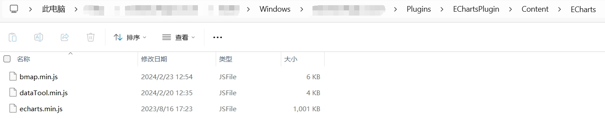
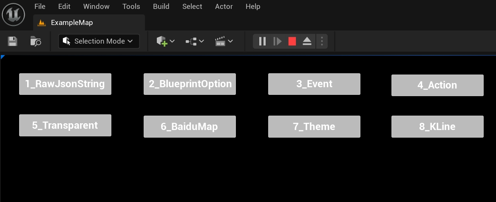

# EChartsPlugin
[Introduction](#introduction)  
[Installation Instructions](#installation-instructions)  
[Packaging Instructions](#packaging-instructions)  
[How to use](#how-to-use)  
[Special blueprint node](#special-blueprint-node)  
[Examples](#examples)  
[Tips and Tricks](#tips-and-tricks)  
[Known Issues](#known-issues)  
[ECharts Option object and plugin Option object correspondence table](#echarts-option-object-and-plugin-option-object-correspondence-table)  

# Introduction
This plugin integrates ECharts into Unreal Engine, based on UMG controls, ECharts version 5.4.4, which can realize most of the charting effects of ECharts, and currently tested the Windows platform, which realizes the following functions:  
1, support the use of blueprint nodes to dynamically create ECharts Option  
2, support the use of Json strings directly ECharts Option  
3, support for some of the ECharts Extension ( such as: Baidu map extension )  
4, support for ECharts click, dbclick, mouseover events , when an event occurs you can receive the Json string of the event in the blueprint to get the event type and data ( more event support is being added )  
5, support DispatchAction, you can use the blueprint to control ECharts.  
6. Support ECharts background transparency  
7, support for EChats theme  

# Installation instructions
## 1, copy the plug-in to the project Plugins directory  
  
## 2, if you need to refer to other Javascript files (for example: Baidu map extension), copy the js file to the plugin's Content\ECharts directory  
  

# Packaging instructions
All the files in the Content\ECharts directory of the plugin will be copied to the output directory when the project is packaged.
  
  
If the program flashes after packaging, see the Known Issues section at the end of this document.  

# How to use  
## 1. Add the ECharts Widget control to the UMG.  
  
## 2. Set the properties of the ECharts Widget control.  
  
Enable Transparent: background transparency  
Extension Script Files: extra js script files loaded on ECharts page (can be the name of js file in Content\ECharts directory or online url address, see example: 6_BaiduMap)  
Theme Json String: Json string of the Theme used by ECharts.  
Events: ECharts events to be received, blueprint will receive the corresponding event Json string.  

## 3. Setting Option for ECharts Widget in Blueprint  
There are two ways to set Option for ECharts Widget.  
Method 1: Construct the Json string of the Option directly, and set the string to the ECharts Widget, see the example: 1_RawJsonString  
  
Method 2: Create and set Option object by blueprint, set the Option object to ECharts Widget, see example: 2_BlueprintOption  
  
Note: When setting Option for an ECharts Widget, the two methods can be used in conjunction with each other to realize flexible and complex Option settings, see example: 8_KLine  
## 4. Receive ECharts events in blueprints  
If ECharts Widget's properties of the event checked, when the event occurs in ECharts you can receive the event in the blueprint Json string, contains the event type and related data, see example: 3_Event  
  
## 5, through the DispatchAction control ECharts, see example: 4_Action  
Call DispatchAction on ECharts Widget to pass in the Json string of the action.  
  
## 6. Dynamic Creation of ECharts Option Objects via Blueprint Node Description
This plugin in the UE ported the vast majority of the objects in the ECharts Option, you can set the object on demand, through the blueprint to construct a complex Option structure.  
  
In the image above, a tooltip object is first created, with the trigger property set, then an axis pointer is created, with the type property set, then the axis pointer object is set to the tooltip, and finally the tooltip object is set to the Option, and the entire Option can be used in this way for almost all Option created, example: 8_KLine.  

When an attribute of an object is set, only then will the corresponding attribute string be generated in the final Option, unset attributes will not appear in the Option, for example, in the above figure the axisPointer object will generate a Json object string in the tooltip: axisPointer: {type:' cross'}, while other properties of axisPointer will not appear. This enables the merge operation of options in ECharts, so that the object that sets the option and the Json string can be used at the same time.  

Plugin ported Option in the structure of the object's attribute names and js to maintain consistency, the object's related properties and input values please refer to the [ECharts configuration items official documentation](https://echarts.apache.org/zh/option.html) (except for a particularly flexible way to write the attributes, such as: series's markPoint data, the object is not refined, you need to use the full string settings, example: 8_Kline. do not rule out the individual object porting problems, if you find that the object affects the use of the function, please leave a message or e-mail feedback).    

In order to realize the flexible writing of attribute values in js, all non-object attributes in the plugin are of string type (example: the left attribute of legend can be entered as 20, '20%', 'left', 'center', 'right', etc.), so if the value of the attribute is of string type, you need to bring single quotes when setting it.  
Example:  
 
 
 
 
  

Since there are a lot of objects with the same name in the Option of ECharts, for example: many of them contain data, some of them have the same data structure (xAxis and yAxis), while others are different. In order to reduce the number of objects in the plugin, the transplantation of objects with the same name is summarized, a structure in the plugin to generate a corresponding object, a variety of structural objects with the same name, the transplantation of the object name with an index number to distinguish between the unique object name without a index number. For example, Echarts Option has 25 data objects with different structures, so the plugin code after porting has EChartsOption_data0 to EChartsOption_data24, a total of 25 data objects, and the data objects in xAxis and yAxis use UEChartsOption_data1, whereas the data objects in the pie of the series use UEChartsOption_data5. refer to [EChartOption object and plugin Option object correspondence table](MapTable.md) for the complete correspondence.  

As you can see in the figure below, in the Set data node of yAxis, data is an array of type EChartsOption_data1  
  
## Special blueprint node  
## 1, SetOption and SetOptionJsonString  
  
  
AdditionalScript in the node can set additional js script, the script position is before the ECharts setOption, you can add the data and function definition of js and call it in Option. The added data and function definitions are global variables that can be accessed subsequently if SetOption is called again, see examples: 6_BaiduMap and 8_KLine.  

The SetOption node returns the Json string of the final generated Option (with AddtionalScript)  
## Examples  
## Run the example
Open the level Content\Example\ExampleMap in the plugin, run the level, and click the corresponding example button to view the example  
  
  
## Example  (more examples added)  
1_RawJsonString  
Set EChartsWidget directly using Option's Json string.  
  
2_BlueprintOption  
Dynamically create an Option object using a blueprint, then use the Option object to set the EChartsWidget.  
  
3_Event  
Checks the ECharts event of interest and receives the data of the event in the blueprint.  
  
4_Action  
Controls the ECharts via the DispatchAction blueprint node of the EChartsWidget using the action's Json string.  
  
5_Transparent  
Set the background of ECharts to transparent  
  
6_BaiduMap  
The official ECharts example: Air Quality in Major Cities - BaiduMap, loads the ECharts BaiduMap extension js file and uses additionalScript to set additional required js data and code when setting the Option of the EChartsWidget.  
  
This example directly uses the AK of the Baidu map api in the ECharts example (https://api.map.baidu.com/api?v=3.0&ak=), please change it to your own AK.  
  
7_Theme  
Set ECharts Theme Json string for EChartsWidget.  
  
8_KLine  
The official example of ECharts: ShangHai Index, using both Json string and Option object to set the Option of EChartsWidget.  

## Tips and Tricks  
## As with ECharts, the plugin can set up Option on demand, and when you need to update the Option, you only need to set the part that needs to be updated.  
For example: 
1, separate the style part and data part of Option, the style part is set only once, the data part can be set when there is a change in the data.  
2、Set some of the attributes that can not be set with Option object, use Json string to set them.  

## ECharts cannot be displayed correctly after setting Option object.
You can get the string returned by the blueprint SetOption node and copy it to the Web version of ECharts for error analysis (if it is a plugin bug, please leave a message or email feedback).  

## Determine the name of the object to be created  
For example: when you need to create a data object, if you are not sure which UEChartsOption_data, you can first create a Set node, then check the type of object you need, and then create a node that constructs that object type, or refer to the correspondence table.  
  

# Known issues  
## 1. Controls do not respond when hidden and then shown again.
If there are more than 5 ECharts Widget controls running at the same time (including the engine built-in WebBrowser control), only 5 controls respond after the control is hidden and then displayed, this is a bug of the engine WebBrowser plugin, see: https://issues.unrealengine.com/issue/UE-171882 **This bug is backlogged, please vote for UE to fix this bug earlier**.

The temporary solution is modify the size of the control and then restore it before resuming the display of the control.  
  
## 2. The packaged program cannot run.
If the project is a pure blueprint project, the plugin runs normally in the editor, but the program flashes back after packing, and the log shows the following error:*LogPluginManager: Error: Unable to load plugin 'WebBrowserWidget'. Aborting.*. But the Web Browser plugin is enabled in the editor.  

## 3. Get svg using jquery
The server needs to configure Access-Control-Allow-Origin* to avoid cors errors

The solution is to add an empty c++ class to the project:  
  
  

# ECharts Option object and plugin Option object correspondence table  
[ECharts Option Object and Plugin Option Object Correspondence Table](MapTable.md)
