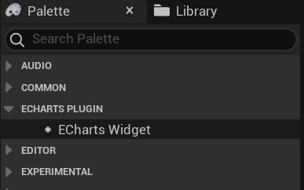

# UnrealEngine-EChartsPlugin
# 1	简介
本插件将ECharts集成到了Unreal Engine中，基于UMG控件，ECharts版本5.4.4，目前测试了Windows平台，实现了以下功能：  
1、	支持使用蓝图节点动态创建ECharts Option  
2、	支持直接使用Json字符串的ECharts Option  
3、	支持部分ECharts Extension（如：百度地图扩展）  
4、	支持ECharts的click、dbclick、mouseover事件，事件发生时可以在蓝图中接收到事件的Json字符串，以获取事件类型及数据（更多事件支持添加中）  
5、	支持DispatchAction，可以使用蓝图控制ECharts  
6、	支持ECharts背景透明控制  
7、	支持EChats主题（Theme）  

# 2	安装说明
## 1、将插件复制到项目的Plugins目录下  
  
## 2、如果需要引用其他Javascript文件（比如：百度地图扩展），将js文件复制到插件的Content\ECharts目录下  
  

# 3	使用方法  
## 1、将ECharts Widget控件添加在UMG中  
  
## 2、设置ECharts Widget控件的相关属性  
  
Enable Transparent：背景透明  
Extension Script Files：ECharts页面额外加载的js脚本文件  
Theme Json String：ECharts使用的Theme的Json字符串  
Events：要接收的ECharts事件，勾选后蓝图节点将收到对应的事件Json字符串  

## 3、在蓝图中为ECharts Widget设置Option  
有两种方法可以为ECharts Widget设置Option。  
方法一：直接构造Option的Json字符串，将该字符串设置到ECharts Widget，参见示例：1_RawJsonString  
  
方法二：通过蓝图创建并设置Option对象，将该对象设置到ECharts Widget，参见示例：2_BlueprintOption  
  
备注：为一个ECharts Widget设置Option时，两个方法可以同时配合使用，以实现灵活、复杂的Option设置，参见示例：8_KLine  
## 4、在蓝图中接收ECharts事件  
ECharts Widget的属性中勾选的事件，当ECharts中该事件发生时可以在蓝图中收到事件的Json字符串，包含事件类型及相关数据，参见示例：3_Event  
  
## 5、通过DispatchAction控制ECharts，参见示例：4_Action  
对ECharts Widget调用DisppatchAction传入action的Json字符串  
  
## 6、通过蓝图节点动态创建ECharts Option对象说明
本插件在UE中移植了绝大部分ECharts的Option中的对象，可以通过蓝图构造复杂的Option结构。  
  
上图中，首先创建了一个tooltip对象，设置了trigger属性，然后创建了一个axis pointer，设置了type属性，再将axis pointer对象设置到tooltip，最后将tooltip对象设置到Option，整个Option几乎都可以使用这种方式创建，示例：8_KLine。  

当对象的某个属性有设置，才会在最终的Option中生成相应的属性字符串，未设置的属性不会出现在Option中，比如上图中axisPointer对象会在tooltip中生成Json对象字符串：axisPointer: {type:’cross’}，而axisPointer的其它属性不会出现。这样可以实现ECharts中option的合并操作，使得设置option的对象和Json字符串可以同时使用。  

插件移植的Option中的对象的结构的属性名与js中保持一致，对象的相关属性及可输入值请参考ECharts官方文档（除个写法特别灵活的属性，比如：series中markPoint的data，该对象没有细化，需要使用完整字符串设置，示例：8_Kline，不排除个别对象移植有问题，如发现影响使用请留言或邮件反馈）。  

为了实现js中属性值的灵活写法，插件中所有非对象属性都为字符串类型（比如：legend的left属性可以输入20、'20%'、 'left', 'center', 'right'等），所以如果属性值是字符串类型，设置时需要带上单引号。  
示例：  
 
 
 
 
  

由于ECharts的Option中存在很多同名对象，比如：很多对象都包含data，部分对象的data结构一致（xAxis和yAxis），而另一些则不同。为了减少插件中的对象数量，移植时将同名的对象进行了汇总，一种结构在插件中生成一个对应的对象，多种结构的同名对象，移植时在对象名后带上索引号加以区分，唯一的对象名则不带序号，比如Echarts的Option中共有25个不同结构的data对象，因此移植后插件代码中有EChartsOption_data0到EChartsOption_data24，共25个data对象，xAxis和yAxis中的data对象使用的是UEChartsOption_data1，而series的pie中的data对象使用的是UEChartsOption_data5。  

下图中通过创建yAxis的Set data节点可以看到，data是EChartsOption_data1类型数组  
  
# 4	特殊蓝图节点说明  
## 1、	SetOption与SetOptionJsonString节点  
  
  
节点中的AdditionalScript可以设置额外的js脚本，脚本位置在ECharts setOption之前，可以添加js的数据和函数定义，并在Option中调用。添加的数据和函数定义为全局变量，后续如果再次调用SetOption时也可以访问，参见示例：6_BaiduMap和8_KLine。  

其中SetOption节点返回了最终生成的Option的Json字符串（含AddtionScript）  
# 5	示例说明  
打开插件中Content\Example\ExampleMap关卡，编辑关卡的LevelBlueprint，在Create Widget节点中选择示例WidgetBlueprint，然后运行关卡（更多示例添加中）  
  
示例功能
1_RawJsonString  
直接使用Option的Json字符串设置EChartsWidget  
  
2_BlueprintOption  
使用蓝图动态创建Option对象，再用Option对象设置EChartsWidget  
  
3_Event  
勾选关心的ECharts事件，并在蓝图中接收该事件的数据  
  
4_Action  
使用action的Json字符串，通过EChartsWidget的DispatchAction蓝图节点控制ECharts  
  
5_Transparent  
设置ECharts背景为透明  
  
6_BaiduMap  
ECharts的官方示例：全国主要城市空气质量 - 百度地图，加载了ECharts百度地图扩展js文件，并在设置EChartsWidget的Option时使用了additionalScript来设置额外所需的js代码  
  
7_Theme  
为EChartsWidget设置ECharts Theme Json字符串  
  
8_KLine  
ECharts的官方示例：上证指数，同时使用了Json字符串和Option对象来设置EChartsWidget  

# 6 使用技巧  
## 与ECharts一样，插件可以按需设置Option，需要更新Option时只需要设置更新的部分内容即可  
比如：
1、把Option的样式部分和数据部分分开，样式部分只设置一次，数据部分可以数据变化时设置。  
2、将无法用Option对象设置的属性，用Json字符串的方式来设置。  

## 设置Option对象后ECharts无法正确显示
可以获取蓝图SetOption节点返回的符串，复制到Web版本的ECharts中进行错误分析（如果为插件bug请留言或邮件反馈）  

## 判断要创建对象的名称  
当需要创建一个data对象时，如果并不清楚是哪个UEChartsOption_data，可以先创建Set节点，然后查看需要的对象类型，再创建构造该类型的节点，或参考后面的对应关系表。  

# 7	已知问题  
## 1、控件隐藏再显示后无响应
同时运行的ECharts Widget控件超过5个时（包含引擎内置WebBrowser控件），控件隐藏再显示后只有5个控件有响应，此为引擎WebBrowser插件bug，参见：https://issues.unrealengine.com/issue/UE-171882 

临时解决办法为在恢复控件的显示前先修改下控件的大小再还原，如下图  
  
## 2、打包后的程序无法运行
如果UE项目为蓝图项目，插件在编辑器中运行正常，但打包后程序无法运行，日志出现如下错误：*LogPluginManager: Error: Unable to load plugin 'WebBrowserWidget'. Aborting.*。但是编辑器中Web Browser插件已启用。  

解决办法为在项目中添加一个空c++类即可：  
  
  
